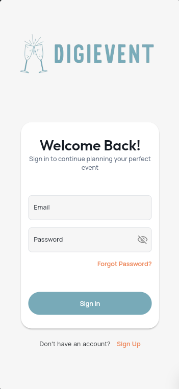
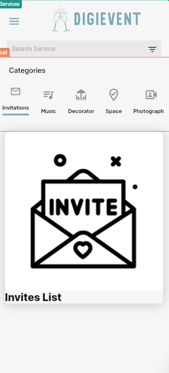
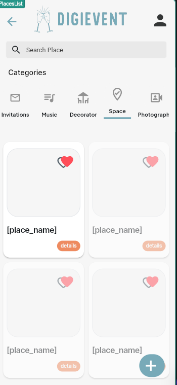
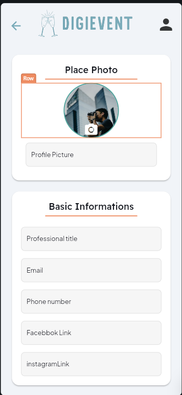
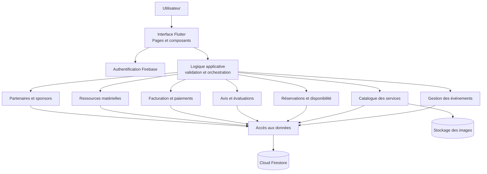

# DigiEvent

DigiEvent est une application de gestion d'événements destinée à centraliser les événements, les prestataires et services, les réservations, les avis, la facturation, les ressources matérielles et les partenariats.

> **État du dépôt :** ce README décrit le périmètre fonctionnel fourni pour le projet ainsi que les éléments repérés dans le code disponible. La présence d'un écran ou d'une collection Firestore ne garantit pas que toutes les opérations décrites ci-dessous soient déjà implémentées.

## Fonctionnalités

### 1. Gestion des événements

- Créer un événement avec son nom, sa date, son heure, sa description et le nombre d'invités.
- Associer à l'événement des services réservés du catalogue.
- Consulter la liste des événements, modifier un événement existant ou le supprimer.

### 2. Catalogue des services

Chaque service comprend un nom, une catégorie (par exemple lieu, décorateur ou musicien), une description détaillée, un prix et des images.

- Ajouter, consulter, modifier et supprimer des services.
- Parcourir le catalogue et filtrer les services par catégorie.

### 3. Réservation des services

- Choisir un ou plusieurs services du catalogue, avec un filtre par catégorie.
- Créer une réservation liée à un événement et à un service, avec sa date et son heure.
- Consulter les réservations d'un événement, les modifier ou les annuler.
- Vérifier la disponibilité du service pour la date choisie avant de confirmer la réservation, afin d'éviter les conflits.

### 4. Avis et évaluations

- Créer un avis pour un service ou un événement, avec une note et un commentaire.
- Consulter, modifier ou supprimer les avis existants.

### 5. Facturation et paiements

- Créer une facture associée à une réservation, avec le détail du service, le montant total et les informations de paiement.
- Consulter l'historique des paiements et des factures d'un client ou d'un prestataire.
- Mettre à jour le statut d'un paiement, par exemple « en attente » ou « payé ».
- Annuler ou supprimer une facture erronée et suivre les remboursements et annulations.

### 6. Ressources matérielles

- Gérer les ressources disponibles à la location : tables, chaises, équipements audio, décorations, etc.
- Consulter leur type, leur quantité, leur tarif et leur disponibilité.
- Ajouter, modifier ou supprimer une ressource.
- Associer les ressources à un événement et suivre les réservations pour prévenir les conflits de disponibilité.

### 7. Partenaires et sponsors

- Ajouter à un événement un partenaire ou un sponsor, avec le nom de l'entreprise, ses coordonnées, son niveau et les conditions du partenariat.
- Consulter, modifier ou supprimer les partenariats associés à un événement.
- Suivre les engagements financiers, les avantages, la visibilité prévue et les obligations contractuelles.
- Coordonner les partenaires impliqués dans la fourniture de services ou de ressources.

## Technologies et structure repérées

- **Application :** Flutter et Dart.
- **Services Firebase utilisés dans le code :** Firebase Authentication et Cloud Firestore.
- **Interface :** structure de pages et de composants générée avec FlutterFlow.

Les sources sont organisées principalement dans `Pages/` et `Components/`. Les écrans repérés couvrent notamment les événements, les lieux, les décorateurs, les photographes, les réservations, les avis, les sponsors et les demandes de sponsoring. Les règles Firestore disponibles se trouvent dans `FirestoreRules/firestore.rules`.

## Aperçu des interfaces

Captures d'écran disponibles dans le dossier `Screenshots/` :

### Connexion



### Catalogue des services



### Catalogue des lieux



### Ajout d'un lieu



### Capture d'écran supplémentaire


## Architecture

Le diagramme suivant présente l'architecture logique recommandée pour organiser les fonctionnalités. Il s'agit d'une vue cible : le dépôt fourni ne permet pas de confirmer que chaque couche ou chaque flux est déjà réalisé.



### Responsabilités des couches

| Couche | Responsabilité |
| --- | --- |
| Interface Flutter | Afficher les pages, recueillir les saisies et présenter les résultats ou erreurs. Les fichiers de `Pages/` et `Components/` appartiennent à cette couche. |
| Logique applicative | Appliquer les règles métier, valider les données et coordonner les opérations entre modules. Elle ne doit pas dépendre directement de détails visuels. |
| Modules métier | Gérer les règles propres aux événements, au catalogue, aux réservations, aux avis, à la facturation, aux ressources et aux partenariats. |
| Accès aux données | Centraliser les lectures et écritures Firestore ainsi que le stockage et la récupération des images. |
| Services Firebase | Fournir l'authentification, la persistance des données et, si configuré, le stockage des images. Les règles de sécurité doivent contrôler les accès côté serveur. |

### Relations entre les données

- Un **événement** porte ses informations principales et peut être associé à plusieurs réservations, avis, ressources et partenariats.
- Une **réservation** relie un événement à un service du catalogue. Elle contient au minimum la date, l'heure et un statut permettant de distinguer une réservation active d'une réservation annulée.
- Un **service** appartient à une catégorie et peut référencer une ou plusieurs images. Les lieux, décorateurs et photographes sont des catégories ou types de prestataires visibles dans le projet ; le modèle unifié du catalogue reste à préciser.
- Une **facture** et un **paiement** se rattachent à une réservation afin de conserver le détail du montant et l'état de règlement.
- Une **ressource matérielle** réservée est rattachée à un événement, avec sa quantité et sa période d'utilisation.
- Un **avis** référence son auteur et sa cible (service ou événement). Un **partenariat** référence l'événement et les informations du partenaire ou sponsor.

Ces relations devraient être représentées explicitement dans les documents Firestore, par exemple avec des identifiants `eventId` et `serviceId`, plutôt qu'en se basant uniquement sur des noms affichés.

### Flux d'une réservation

1. L'utilisateur sélectionne un événement, un service et une date/heure.
2. La logique applicative vérifie que l'utilisateur est autorisé à réserver et que les champs requis sont valides.
3. La disponibilité est contrôlée pour le service et le créneau. La vérification et la création de réservation doivent être atomiques (transaction ou mécanisme équivalent) pour éviter que deux utilisateurs réservent simultanément le même créneau.
4. La réservation est enregistrée avec ses références et son statut. La facture et le paiement peuvent ensuite être créés ou mis à jour en lien avec cette réservation.
5. En cas d'annulation, le statut est mis à jour et le créneau redevient disponible selon les règles métier.

## Configuration et lancement

Le dépôt fourni ne contient pas de `pubspec.yaml` à sa racine. Il manque donc le manifeste Flutter nécessaire pour installer les dépendances et lancer l'application depuis cette copie. Une fois le projet Flutter complet disponible :

1. Installer le SDK Flutter et configurer les plateformes ciblées (Android, iOS ou Web).
2. Configurer un projet Firebase, enregistrer les applications correspondantes et vérifier l'initialisation Firebase dans le projet.
3. Depuis le dossier contenant `pubspec.yaml`, récupérer les dépendances puis lancer l'application :

   ```bash
   flutter pub get
   flutter run
   ```

Les paramètres Firebase et les commandes de lancement peuvent varier selon les fichiers de configuration et les plateformes du projet complet.

## Données Firestore et sécurité

Les règles fournies déclarent notamment les collections `user`, `event`, `reservation`, `avis`, `Decorator`, `Photographer`, `Place`, `sponsors`, `DemandesSponsorisations`, `musique`, `guest` et `invitation`.

**Attention :** dans les règles actuelles, la lecture et la création sont autorisées sans authentification sur ces collections, tandis que les mises à jour et suppressions sont refusées. Ces règles ne fournissent donc pas les permissions nécessaires à un CRUD complet et ne doivent pas être considérées comme une configuration de production. Avant tout déploiement, limiter les accès aux utilisateurs authentifiés et autorisés, puis définir les permissions requises pour chaque opération et chaque type de donnée.

## À compléter

- Ajouter le manifeste `pubspec.yaml` et les fichiers nécessaires à une application Flutter exécutable, s'ils ne se trouvent pas dans une autre copie du projet.
- Vérifier et finaliser les opérations CRUD de chaque module.
- Mettre en place la vérification transactionnelle de disponibilité des services et des ressources pour éviter les réservations concurrentes.
- Ajouter les modèles de données et les règles de sécurité pour les factures, les paiements et les ressources matérielles.
- Tester les parcours de création, consultation, modification, annulation et suppression avec différents rôles d'utilisateur..